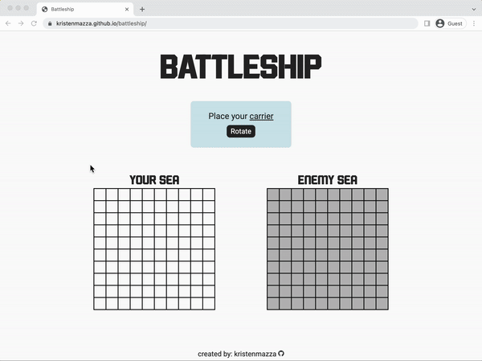

# Battleship
Single-player game based on the classic Battleship strategic board game.

[Live Demo](https://kristenmazza.github.io/battleship/) :point_left:

## How to Play
1. Set up the game by placing your ships on your board.
2. Each player (user and computer player) takes turns attacking the opponent's gameboard.
3. To make an attack, click on an open space on the opponent's gameboard. If your attack successfully hits one of the opponent's ships, the space will turn red. If your attack misses, the space will turn blue. To sink a ship, you must hit all the spaces that contain that ship. Once a ship is sunk, X's will appear on the ship to indicate its status.
4. The first player to sink all of the opponent's ships wins.

## Learning Objectives
In this project, the main goal was to practice using Test Driven Development (TDD). This was my first time writing tests and delving into Jest, a JavaScript testing framework.

## Lessons Learned
- Learning how and when to mock functions was a challenge. I was confused about how mocking worked specifically for functions nested within the function that needed to be tested. Eventually, I realized that once a function value is mocked, the tested function will automatically use that mocked value without needing to be explicitly instructed to do so. My main use of mocking was for functions that generated random numbers (for determining the random placement of ships). This was necessary because the tests I conducted required known values to ensure the results would be accurate.
- It took a while for me to wrap my mind around the math needed to convert grid position to array position [x, y] coordinates.
  - Converting the [x, y] coordinates to the grid position was relatively easy using a lookup mechanism. Each gameboard consists of a 10x10 grid (a total of 100 squares). To facilitate a connection between the grid and the underlying data stored in a 2D array, I assigned each grid square div a `data-id` number ranging from 0 to 99. I then created a lookup called `squareIds`, which is a 2D array of numbers from 0 to 99. Each `squareId` in the lookup corresponds to the `data-id` number on the div and can be found by providing [x, y] coordinates.
  - A challenging part came when I needed to convert the grid position back to the [x, y] coordinates. This was needed for gameplay functions such as clicking a square to attack the opponent's gameboard. The x coordinates and the y coordinates could be found using simple math, but this was not immediately obvious to me. This problem was solved through division and use of the modulo operator. For example, when a player attacks the opponent's gameboard, the attacked square's id is converted using the following: `x = Math.floor(squareId / 10)` and `y = squareId % 10`. For example, if targeting squareId 27, the coordinates would be (2, 7), and if targeting squareId 1, the coordinates would be (0, 1).
- I found it a little tricky to allow users to place their own boats by clicking on the gameboard. I wasn't sure at first how to make it so each time the player clicked, a different boat would be placed. I ended up solving this by creating an object that contained the player's boats and a variable `k` to iterate through the boats in the object. When the user clicks a square, the function is called to place the first boat on the grid. The function then increases `k` by 1. This enables the next boat to be placed the next time the function is called. The event listener is then removed when there are no more boats remaining.

# Setup Instructions
1. Install dependencies (`npm install`)
2. Generate assets (`npm run build`)
3. Run server (`npm start`)
4. Run tests with `npm test`